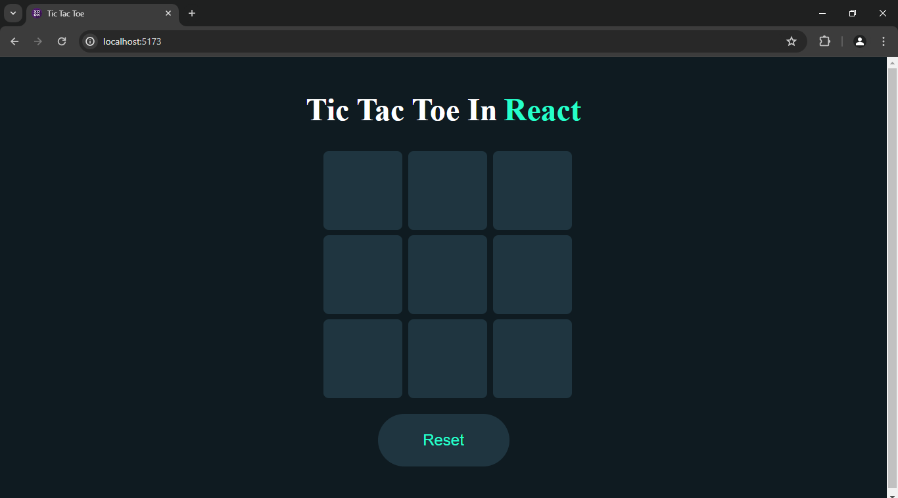
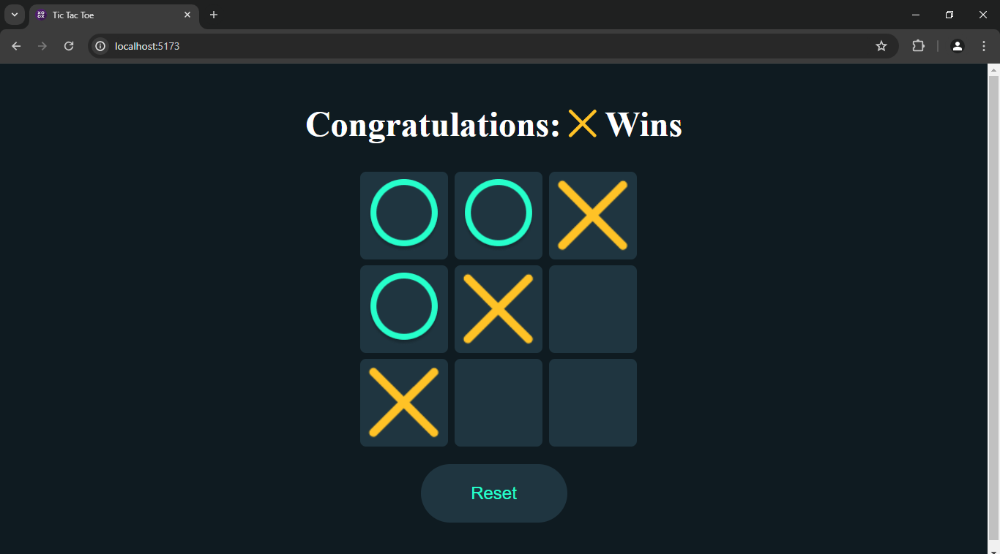
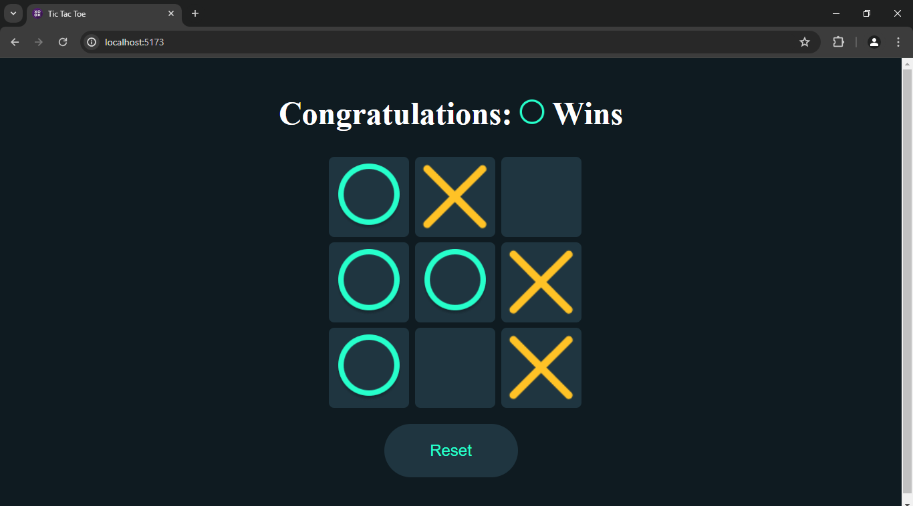

# Tic Tac Toe in React

This is a simple Tic Tac Toe game built using React.js with Vite as the development tool. The game allows two players to play against each other and announces the winner.

## Table of Contents

- [Installation](#installation)
- [Usage](#usage)
- [Features](#features)
- [Screenshots](#screenshots)
- [Technologies](#technologies)

## Installation

1. Clone the repository:
    ```bash
    git clone https://github.com/kaustubh-01/Tic-Tac-Toe.git
    cd Tic-Tac-Toe
    ```

2. Install dependencies:
    ```bash
    npm install
    ```

3. Start the development server:
    ```bash
    npm run dev
    ```

4. Open your browser and navigate to `http://localhost:5173` to see the application in action.

## Usage

- Click on a cell to place your mark (X or O).
- The game will automatically detect when a player has won or if the game ends in a draw.
- Click the "Reset" button to start a new game.

## Features

- Interactive Tic Tac Toe game with two-player mode.
- Dynamic win detection and announcement.
- Simple and clean UI.

## Screenshots

### Initial Screen


### X Wins


### O Wins


## Technologies

- React.js
- Vite
- CSS


